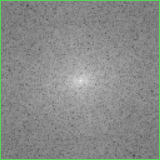
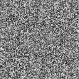
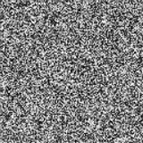

# Fourier-transform

## DCT

- There are two classes, which are named DCT1 and DCT2, and a utils file. You can easily to learn how to make DCT by these code and some pictures will showed below.

- As for the O(n^4), the speed of DCT is so slow that we will resize the picture into 128 * 128.

### Comparison
- Original Image

- Processed Image by DCT

​	As we can see the picture is light on four corners, and we need to gather the pixels, and show as below.

- Result of Centering

​	The above picture shows the results of the combination of the real part and the imaginary part. We can also get the real part and the imaginary part separately.

- Real Part and Imaginary Part

Real Part

 Imaginary Part

### Some procession
- In order to be able to observe more clearly, a logarithmic transformation of the above results is required, and normalization is also need.

$$x=\log(x+1)​$$

$$ x = \frac{x - min}{max - min} $$

## FFT and DCT

- FFT and DCT is also implemented and their usage is similar.