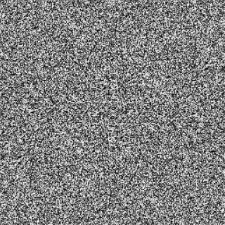

# Fourier-transform

  The RGB images used in this project are as follows, and its size is [400, 400, 3].


​    The language used in this project is C++. The completed algorithms are DFT, FFT, and DCT, and the changes are reversed for the three types.

​     Note: In the following experiment, the experiment is performed with a picture size of 256, that is, first converted into a gray scale image, then the gray scale image is resized, transformed to a size of 256*256, and discrete Fourier transform and discrete are performed. Cosine transform.

## DCT

​    In digital images, the image signal is a two-dimensional spatial signal with two attributes of height and width. When converting an image signal into a frequency domain, a two-dimensional discrete Fourier transform is needed.

​    The formula for continuous transformation is as follows:

$$
F(u,v) = \int_{-\infty}^{+\infty}\int_{-\infty}^{+\infty}f(x,y)e^{-i2\pi(ux+vy)dxdy}​
$$

​    After discretization, it is obtained:

$$
F(u,v) = \sum_{y=0}^{N-1}\sum_{x=0}^{M-1}f(x,y)e^{-i2\pi(ux/M+vy/N)}=\sum_{y=0}^{N-1}e^{-i2\pi vy/N}\sum_{x=0}^{M-1}f(x,y)e^{-i2\pi ux/M}​
$$

​    From the discretized formula, and after a little processing, it can be seen that the two-dimensional Fourier transform can perform discrete Fourier transform on each row of the digital image, and then transform each column from the generated result. The Fourier transform can be used to obtain a two-dimensional Fourier transform. Similarly, the inverse Fourier transform can be performed. The formula is as follows:

$$
f(x,y) = \frac {1}{MN} \sum_{v=0}^{N-1}\sum_{u=0}^{M-1}F(u,v)e^{-i2\pi(ux/M+vy/N)} =  \frac{1}{N} \sum_{v=0}^{N-1}e^{-i2\pi vy/N}  \frac{1}{M} \sum_{u=0}^{M-1}F(u,v)e^{-i2\pi ux/M}​
$$

​    Similarly, the inverse Fourier transform can also inversely transform the row and then inverse transform the column. The time complexity is analyzed here:

​    Obviously, as can be seen from the above formula, in calculating the transformed value of a pixel, it is necessary to traverse the entire pixel matrix and $e^{u2\pi ux/M} = cos(2\pi ux/M) + isin(2\pi ux/M)$ which need to perform two sine and cosine transforms. Total $O(MN)$. And when calculating the transformation of the whole image, it is necessary to calculate all the pixels, that is, the total time complexity is $O(M^2 N^2)$, that is, the transformation is completed by the quadruple loop, and the code is as follows:

``` C++
for (int u = 0; u < height; u++) {
    for (int v = 0; v < width; v++) {
        for (int x = 0; x < height; x++) {
            for (int y = 0; y < width; y++) {
                double powerX = u * x * fixed_factor_for_axisX;
                double powerY = v * y * fixed_factor_for_axisY;
                cplTemp.m_rl = matrix[y + x * width] * cos(powerX + powerY);
                cplTemp.m_im = matrix[y + x * width] * sin(powerX + powerY);
                m_dft2_matrix[v + u * width] = m_dft2_matrix[v + u * width] + cplTemp;
                }
            }
        }
    }
```

​    Obviously, the speed of such a quadruple cycle will be very slow. For example, for a $256 * 256$ image, it needs $256 * 256 * 256 * 256$=4.2 billion times. This operation will be extremely slow, using the ctime module. The calculation time is counted and obtained:
$$
T_{used-FFT} = 605.696s
$$
​    In the above formula of the Fourier transform, we can see that the result of the transformation of each point is a complex number, that is, containing the real part and the imaginary part, for example $x = a + b i$, the spectrum after the complete display Fourier transform At the time, the real spectrum and the imaginary part spectrum may be included, and the real part and the imaginary part may be combined and obtained $\sqrt{a^2 + b^2}​$.

​    In the image display of the Fourier transform, some additional processing is needed. Since the value range of the Fourier transform is very wide, there will be only one bright point in the direct display, which is very unfavorable for the display of the result. You can use the log function to make the values a little more concentrated, and the result of the transformation will be more clear by $x = log(x +1) $. 

​    Here, x represents the combined value of the real part and the imaginary part, and adding 1 ensures that the result is a positive number.

​    And to display in the form of a picture, you need to convert to the range of $0-255$, as follows, where ​$min$ and ​$max$ are the minimum and maximum values in the transformation result respectively.

$$
x = \frac{x-min}{max-min}​
$$

​    The real spectrum obtained is as follows:



​    The imaginary spectrum obtained is as follows:


​    Both spectra appear to be very noisy noise spots, but the results can be obtained by converting to a complete amplitude spectrum. Here we can clearly see that the Fourier transform will be brighter at the four angular positions. The middle part will be dim.


​    Simultaneously using the translatability of the Fourier transform, the bright spot can be moved to the middle.

​    By converting the original data to $(-1)^{x+y}f(x,y)​$, you can move the spectrum to the center point and observe the complete spectrum image. The results are shown below:


​    As shown in the figure above, the resulting Fourier transform results for the center bright spot. Then transform the transformed result back to the original image to get the lower gray scale image:


## FFT

​    As stated in the DFT Discrete Fourier Transform, the time complexity required to perform a Fourier transform is $O(M^2 N^2)$ , it is too slow, so an FFT, Fast Fourier Transform, and Fast Fourier Transform are used. The related properties of the leaf transform, which reduce the amount of calculation and make the calculation speed greatly improved, the principle is briefly described:

​    For the one-dimensional Fourier transform, if the calculated signal length is $L = 2^N$, the one-dimensional Fourier transform is abbreviated as follows:

$$
F(u)=\sum_{x=0}^{L-1}f(x)W_L^{ux}, W_L^{ux}=e^{-i2\pi ux/L}
$$

​    The $f(x)$ of x are divided into two groups:
$$
\ 
\begin{cases}
f_1(x)=f(2r) \\
f_2(x)=f(2r+1)
\end{cases}
$$

​    Then the one-dimensional Fourier transform can be converted as follows:
$$
\begin{equation}
\begin{split}
F(u)
&=\sum_{r=0}^{L/2-1}f(2r)W_L^{2ru}+\sum_{r=0}^{L/2-1}f(2r+1)W_L^{(2r+1)u}\\
&=\sum_{r=0}^{L/2-1}f_1(r)W_{W/2}^{ru}+\sum_{r=0}^{L/2-1}f_2(r)W_{W/2}^{ru} \\
&=F_1(u)+W_L^uF_2(u)
\end{split}
\end{equation}
$$
​    Thus, the one-dimensional Fourier transform is converted into two parts. In this example, it can be seen that the Fourier transform of the signal of length $L$ is calculated, and only two Fourier transforms of length $L/2$ need to be calculated. Then the number of calculations needs to be transformed from the original $L^2$ to $2 * (L/2)^2 = L^2 / 2$, and it can be seen that the decomposition is performed once, and the calculation time is shortened. When the decomposed Fourier transform expression is further decomposed, the running time can be greatly shortened, and the total time is shortened. The complexity is $O(nlogn)$.

​    The butterfly operation formula is as follows:
$$
\begin{cases}
F(u)=F_1(u)+W_L^uF_2(u)\\
F(u+L/2)=F_1(u)-W_L^uF_2(u)
\end{cases}
$$
​    So for a two-dimensional image signal, the time complexity required is:
$$
O(NlogN * MlogM) = O(MNlogMN)
$$
​    It can be seen that the time complexity is much lower than that in the DFT, and the calculation is faster. The corresponding implementation is still performed in the DFT. The result of the Fourier transform is as follows, and the operation time is as follows:
$$
T_{used-FFT} = 0.029s
$$


​    The resulting spectrum map, such as the discrete Fourier transform, is also consistent.

## DCT

​    The discrete cosine transform is a kind of transform that is similar to the Fourier transform, but it has only the real part and the transform using the cosine function. The corresponding discrete cosine transform formula is as follows:
$$
F(u,v)=\alpha(u)\alpha(v)\sum_{x=0}^{M-1}\sum_{y=0}^{N-1}f(x,y)
cos\frac{(2x+1)u\pi}{2M}cos\frac{(2y+1)v\pi}{2N}
$$

$$
\alpha(u) =
\begin{cases}
\frac{1}{\sqrt(M)} & \text{u = 0}   \\
\sqrt{\frac{2}{M}} & \text{u $\neq$ 0}
\end{cases}
$$

$$
\alpha(v) =
\begin{cases}
\frac{1}{\sqrt(M)} & \text{v = 0}   \\
\sqrt{\frac{2}{M}} & \text{v $\neq$ 0}
\end{cases}
$$

​    The corresponding inverse discrete cosine transform formula is as follows:
$$
f(xy)=\sum_{x=0}^{M-1}\sum_{y=0}^{N-1}\alpha(u)\alpha(v)F(u,v)
cos\frac{(2x+1)u\pi}{2M}cos\frac{(2y+1)v\pi}{2N}
$$

$$
\alpha(u) =
\begin{cases}
\frac{1}{\sqrt(M)} & \text{u = 0}   \\
\sqrt{\frac{2}{M}} & \text{u $\neq$ 0}
\end{cases}
$$

$$
\alpha(v) =
\begin{cases}
\frac{1}{\sqrt(M)} & \text{v = 0}   \\
\sqrt{\frac{2}{M}} & \text{v $\neq$ 0}
\end{cases}
$$

​    It can be seen that the discrete cosine transform is similar to the Fourier transform, similar to the result of calculating only the real part. The calculation of the result of this part is consistent with the DCT algorithm, and can be completed using a quadruple loop with high time complexity and running. The time and results are as follows:
$$
T_{used-DCT} = 447.483s
$$


​    It is found here that the result of the discrete cosine transform is inconsistent with the result of the Fourier transform, which has the highest frequency in the upper left corner, and the Fourier transform is scattered in four corners.

​    The effect of the discrete cosine transform in the above figure may not be very good. Most of the points are gray, while there are very few high-frequency points in the upper left corner. The reason for the analysis may be when doing $log$ transformation. Caused, but when using other functions to transform, can not achieve a better display, it still retains the same $log$ function as the Fourier transform.
